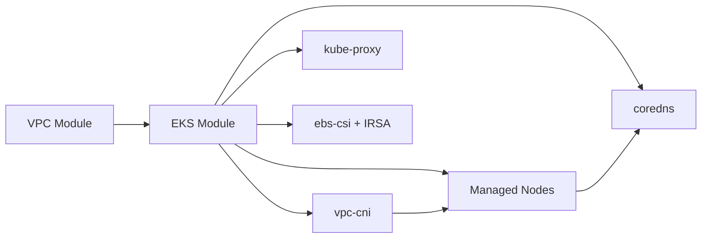

# EKS Terraform Platform

Production-grade Terraform for Amazon EKS: reusable modules, isolated environments, remote state, CI/CD hooks, and operational documentation.

## Repository layout

```
terraform_eks/
├── .github/workflows/          # CI: fmt, validate, tfsec, optional plan
├── bootstrap/backend/            # One-time S3 + DynamoDB for remote state
├── docs/                         # Architecture, dependencies, runbook
├── environments/
│   ├── dev/                      # Development stack
│   ├── staging/                  # Pre-production stack
│   └── prod/                     # Production stack
├── kubernetes/addons/            # Post-cluster Helm add-ons (guidance)
├── modules/
│   ├── vpc/                      # VPC, subnets, NAT, optional flow logs
│   └── eks/                      # EKS, KMS, IRSA, add-ons, node groups
├── scripts/                      # Bootstrap and kubectl helpers
├── Makefile                      # Standard workflows
├── CONTRIBUTING.md
├── CHANGELOG.md
└── CODEOWNERS
```

## Quick start

### 1. Prerequisites

| Tool | Version |
|------|---------|
| Terraform | 1.5+ (see `.terraform-version`) |
| AWS CLI v2 | Latest |
| kubectl | Match EKS version |
| make | Optional but recommended |

AWS credentials with permissions for VPC, EC2, EKS, IAM, KMS, S3, DynamoDB, CloudWatch.

### 2. Bootstrap remote state (once)

```bash
cp bootstrap/backend/terraform.tfvars.example bootstrap/backend/terraform.tfvars
# Edit state_bucket_name (must be globally unique)

make bootstrap-backend
# or: ./scripts/bootstrap-backend.sh
```

### 3. Configure an environment

```bash
cd environments/dev
cp backend.hcl.example backend.hcl      # Fill bucket, table, region
cp terraform.tfvars.example terraform.tfvars
```

### 4. Deploy

```bash
make init ENV=dev
make plan ENV=dev
make apply ENV=dev
./scripts/setup-kubectl.sh dev
```

## Environment differences

| Setting | dev | staging | prod |
|---------|-----|---------|------|
| VPC CIDR (example) | `10.10.0.0/16` | `10.20.0.0/16` | `10.30.0.0/16` |
| AZs | 2 | 3 | 3 |
| NAT | Single | Per-AZ | Per-AZ |
| VPC flow logs | Off | On | On |
| API CIDR | Open (change!) | Restricted | Restricted |
| Control plane logs | Minimal | Full | Full |
| Node type (example) | `t3.medium` | `m6i.large` | `m6i.xlarge` |

## Production features

- **Remote state**: S3 versioning + encryption + DynamoDB locking
- **KMS**: Cluster secrets encryption with key rotation
- **Logging**: Configurable EKS control plane log types
- **Network**: Multi-AZ public/private/intra/database subnets
- **Security**: IMDSv2 required, API CIDR restrictions, IRSA for EBS CSI
- **CI**: GitHub Actions validate/fmt/tfsec on PRs
- **Quality**: pre-commit, tflint, terraform-docs hooks

## Documentation

| Document | Contents |
|----------|----------|
| [docs/architecture.md](docs/architecture.md) | Design, state partitioning, extensions |
| [docs/dependencies.md](docs/dependencies.md) | Terraform and runtime dependency graphs |
| [docs/runbook.md](docs/runbook.md) | Deploy, upgrade, scale, destroy, incidents |
| [CONTRIBUTING.md](CONTRIBUTING.md) | Branching, promotion, secrets policy |
| [kubernetes/addons/README.md](kubernetes/addons/README.md) | Post-Terraform cluster add-ons |

## Makefile reference

```bash
make help
make bootstrap-backend
make init ENV=dev
make plan ENV=dev
make apply ENV=dev
make destroy ENV=dev
make fmt
make validate ENV=dev
```

## Service dependency overview



Full detail: [docs/dependencies.md](docs/dependencies.md).

## CI/CD

`.github/workflows/terraform-ci.yml` runs on PRs:

- `terraform fmt -check` (all directories)
- `terraform validate` for dev, staging, prod
- `tfsec` security scan
- Optional `terraform plan` for dev when `AWS_ROLE_ARN` secret is configured

## Security checklist (before prod)

- [ ] Restrict `cluster_endpoint_public_access_cidrs`
- [ ] Use per-AZ NAT (`single_nat_gateway = false`)
- [ ] Enable VPC flow logs
- [ ] Pin `cluster_version` and test upgrades in staging
- [ ] Store state in dedicated AWS account or with tight S3 bucket policy
- [ ] Enable AWS CloudTrail and monitor EKS audit logs
- [ ] Install network policies and Pod Security Standards for workloads

## License

Internal / educational use. Verify third-party module licenses for your organization.
