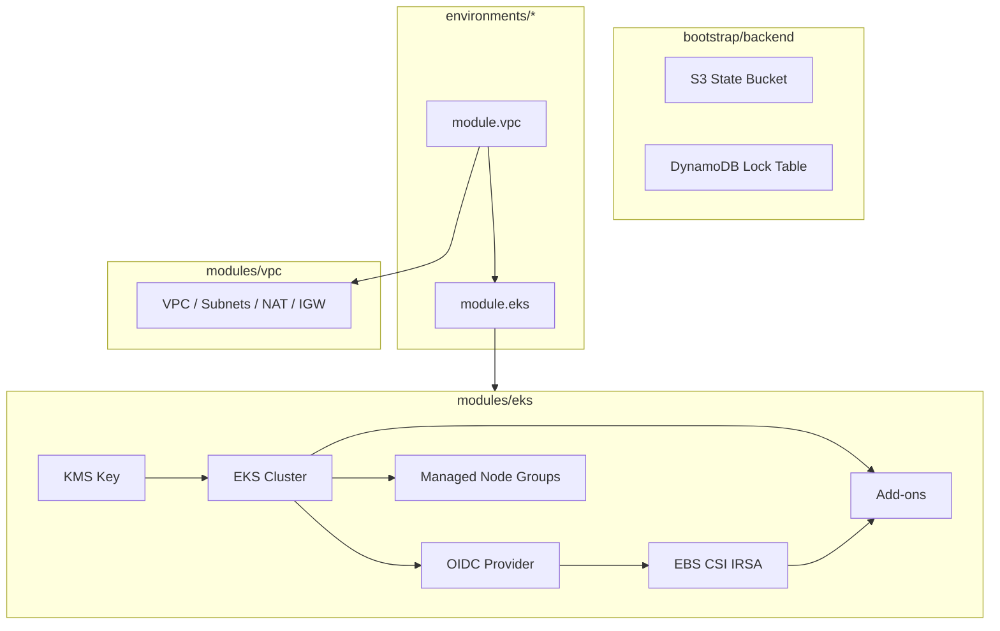

# Service dependencies

## Terraform resource dependency chain

## Apply order (effective)

| # | Resource | Waits for |
|---|----------|-----------|
| 1 | AZ data source | AWS API |
| 2 | VPC, subnets, IGW | AZs |
| 3 | NAT, routes | Public subnets |
| 4 | KMS key | — |
| 5 | EKS cluster IAM + cluster | VPC, subnets, KMS |
| 6 | OIDC provider | Cluster |
| 7 | EBS CSI IAM role | OIDC |
| 8 | Add-ons (CNI first implicitly) | Cluster, CSI role |
| 9 | Node group | Cluster, subnets |

## In-cluster runtime dependencies

| Component | Depends on | If broken |
|-----------|------------|-----------|
| amazon-vpc-cni | Nodes, IAM | Pods lack IPs |
| kube-proxy | Registered nodes | ClusterIP broken |
| coredns | CNI, nodes | DNS failures |
| aws-ebs-csi-driver | IRSA, nodes | PVCs pending |
| Workloads | CNI, DNS | CrashLoop / Pending |

## External AWS services

| Service | Used by |
|---------|---------|
| IAM | Cluster role, node role, IRSA |
| EC2 | Managed nodes, ENIs |
| EKS | Control plane |
| KMS | Secrets encryption |
| CloudWatch Logs | Control plane logs |
| S3 / DynamoDB | Terraform state (bootstrap) |
| NAT Gateway | Private subnet egress (ECR, APIs) |
